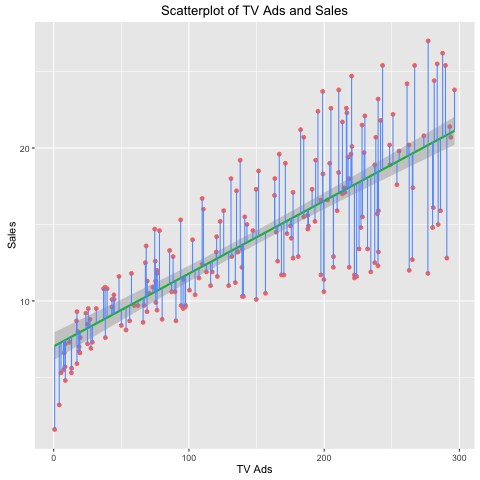

## Abstract  
This reports attempts to reproduce the results of advertising and sales found in section 3.1 Simple Linear Regression of [*An Introduction to Statistical Learning*](http://www-bcf.usc.edu/~gareth/ISL/ISLR%20Sixth%20Printing.pdf). 
  
  
## Introduction  
The Advertising dataset contains data on sales (in thousands of units) for a particular product as a function of advertising budgets (in thousands of dollars) for TV, radio, and newspaper media. The goal is to suggest, on the basis of this data, a marketing plan for next year that will results in high product sales. In this report, we will focus specifcally on the TV budget and its relationship with sales. Some questions we would like to explore include:      
  
1. What are the average TV ads budget and average sales in this dataset?  
2. Is there a relationship between TV ads budget and sales?  
3. How strong is the relationship?  
4. Is the relationship linear?  
  
  
## Data  
This dataset has information on TV, Radio, and Newspaper budgets. On this paper, we will focus on the relationship between *TV budget* and *product sales*.  
Some preliminary analysis of the dataset include:  
  
-there are 200 observations of each TV budget and sales  
-histograms below show the distribution of TV budget and sales data  
  
  
Figure 1: Distributions of TV Budget and Sales Data  
```{r fig.width=3, fig.height=20, echo=FALSE, fig.align = "center"}
library(png)
library(grid)
histogram_tv <- readPNG("../images/histogram-tv.png")
grid.raster(histogram_tv)
```

```{r fig.width=3, fig.height=20, echo=FALSE, fig.align = "center"}
histogram_sales <- readPNG("../images/histogram-sales.png")
grid.raster(histogram_sales)
```


## Methodology
We want to observe if there is a linear relationship between TV budget and Sales. Let's consider the regression model: 
$$Sales = \beta_0 + \beta_1 TV$$   
To estimate the coefficients $\beta_0$ and $\beta_1$, we use the least squares minimization method. 

  
## Results
```{r, echo = FALSE}
#install.packages("xtable")
library(xtable)
library(knitr)
library(stargazer)
load("../data/regression.RData")
```
After computing the regression, we found the following results:  
  
Table 1: Regression Coefficients
```{r, echo = FALSE, results = "asis"}
print(xtable(summary(reg_TV.Sales)), type = "latex", comment = FALSE)
```
  
Some measurements of quality of regression:  
  
Table 2: Regression Quality Statistics  
```{r, echo = FALSE, results = "asis"}
print(xtable(reg_quality), type = "latex", comment = F)
```
  
Figure 2: Scatterplot of Regression  
  
  
## Conclusions  
Looking at the scatterplot, sales seems to vary more with a higher TV budget and when budget is near 0, sales seem to grow expoentially with TV budget. 


